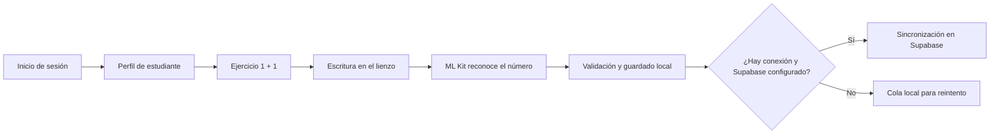

<<<<<<< HEAD
# K-Mat IA

Aplicación Android de refuerzo matemático para niños. Su propósito es complementar el aprendizaje escolar con actividades cortas, respuesta escrita directamente en la pantalla y acompañamiento para responsables y docentes.

El proyecto se encuentra en una etapa de MVP funcional. La práctica actual se concentra en el primer ejercicio, `1 + 1`, y sirve como base para ampliar el catálogo de actividades y la adaptación pedagógica.

## Estado actual

| Módulo | Estado | Alcance actual |
| --- | --- | --- |
| Inicio de sesión y registro | Implementado | Autenticación con Supabase, registro de responsables, recuperación de contraseña y cierre de sesión. |
| Roles | Implementado parcialmente | Se resuelve el área de responsable, docente o administración desde la base de datos. Las áreas de docente y administración son pantallas iniciales. |
| Inicio del estudiante | Implementado | Pantalla de bienvenida, navegación adaptable para celular y tableta, y perfil de demostración de Tomás. |
| Ejercicio `1 + 1` | Implementado | El niño escribe con dedo o lápiz digital; la app reconoce el número, lo valida y guarda el intento. |
| Reconocimiento de escritura | Implementado | Usa Google ML Kit Digital Ink con el modelo español. Reconoce trazos de números escritos en el lienzo; no usa cámara ni OCR de imágenes. |
| Trabajo sin conexión | Implementado para la práctica | El ejercicio, las sesiones, los intentos, los trazos y las métricas se guardan primero en Room en el dispositivo. El modelo de escritura debe descargarse una vez. |
| Sincronización | Implementación base | Una cola local envía sesiones e intentos a una Edge Function de Supabase cuando hay red y la configuración remota está disponible. |
| Base de datos | Implementado | Esquema relacional, reglas de acceso, migraciones, población inicial de ejemplo y función de sincronización. |
| Diagnóstico, progreso y configuración | Navegación creada | Las pantallas muestran la ruta prevista, pero todavía no presentan datos reales ni lógica pedagógica completa. |
| Pausas activas y retroalimentación | Interfaz creada | Existe el flujo visual; faltan detección/seguimiento de la actividad y mensajes basados en cada intento. |

## Flujo disponible



## Arquitectura

La aplicación Android está organizada por capas:

```text
Interfaz Compose → ViewModel → Casos de uso → Repositorios
                                              ├─ Room (datos locales)
                                              ├─ ML Kit Digital Ink (escritura)
                                              └─ Supabase (autenticación y sincronización)
```

La estructura principal del repositorio es:

```text
android-app/    Aplicación Kotlin, Jetpack Compose, Room y pruebas Android
supabase/       Migraciones SQL, Edge Function y documentación de datos
Mockups/        Referencias visuales de las pantallas
```

## Tecnologías

- Kotlin y Jetpack Compose con Material 3.
- Android SDK 35; mínimo Android 8.0 (API 26).
- Room para persistencia local.
- WorkManager para sincronización diferida.
- Google ML Kit Digital Ink Recognition para reconocer números escritos a mano.
- Supabase Auth, PostgreSQL con RLS y Edge Functions.

## Ejecutar la app

1. Abre [android-app](android-app) en Android Studio.
2. Usa el JDK integrado de Android Studio y sincroniza Gradle.
3. Ejecuta la aplicación en un dispositivo o emulador con Android 8.0 o superior.

Durante una práctica ya iniciada, la corrección y el guardado local no dependen de la red una vez descargado el modelo de escritura. El inicio de sesión, el registro y la sincronización requieren configurar Supabase. Consulta la guía de [Android](android-app/README.md) y la [documentación de base de datos](supabase/DOCUMENTACION_BASE_DE_DATOS.md).

## Configuración de Supabase

Las migraciones están en [supabase/migrations](supabase/migrations). Se aplican por fecha, en este orden:

1. `20260930160000_kmat_schema.sql`
2. `20261001235500_area_usuario_autenticado.sql`
3. `20261002001000_registro_responsable.sql`

El archivo [poblacion_inicial_mvp.sql](supabase/poblacion_inicial_mvp.sql) agrega roles, catálogos y datos de demostración. Antes de ejecutarlo se deben crear en Supabase Authentication los usuarios de ejemplo que el mismo archivo indica.

Para desarrollo, las propiedades de conexión de Android se pueden definir en `%USERPROFILE%\.gradle\gradle.properties`:

```properties
SUPABASE_URL=https://TU_PROYECTO.supabase.co
SUPABASE_ANON_KEY=tu_clave_anon_publica
SUPABASE_STUDENT_ID=uuid_del_estudiante
SUPABASE_EXERCISE_VERSION_ID=uuid_de_la_version_del_ejercicio
```

La clave `service_role` pertenece exclusivamente al entorno de la Edge Function; nunca debe ir en la aplicación Android ni en el repositorio.

## Pruebas realizadas

Hay pruebas instrumentadas para el reconocimiento de escritura y la pantalla de práctica. Se verificó la escritura de los números `2` y `4`, el reconocimiento de `2` para resolver `1 + 1`, la limpieza del lienzo, la validación de la respuesta y la visualización de controles en teléfono vertical, teléfono horizontal y tableta.

Desde `android-app`, se ejecutan con:

```powershell
.\gradlew.bat connectedDebugAndroidTest
```

## Próximos avances

- Incorporar más ejercicios y seleccionar el perfil real del estudiante.
- Construir diagnóstico, progreso, retroalimentación y pausas activas con datos reales.
- Completar las herramientas de responsables, docentes y administración.
- Vincular el catálogo de ejercicios remoto y validar la sincronización completa en un entorno desplegado.
- Agregar adaptación de dificultad, recursos de apoyo y reportes de progreso.

## Documentación relacionada

- [Arquitectura Android](android-app/docs/ARQUITECTURA.md)
- [Autenticación](android-app/docs/AUTENTICACION.md)
- [Operación offline y sincronización](android-app/docs/OFFLINE_FIRST.md)
- [Navegación](android-app/docs/NAVEGACION.md)
- [Modelo y operación de base de datos](supabase/DOCUMENTACION_BASE_DE_DATOS.md)
=======
# kmat
K-Mat: aplicación educativa de matemáticas para 1° y 2° básico, con ejercicios adaptativos, reconocimiento de escritura y seguimiento del progreso.
>>>>>>> 5390f4410ea6eb7d2ee71cf3a851fec39255adbd
