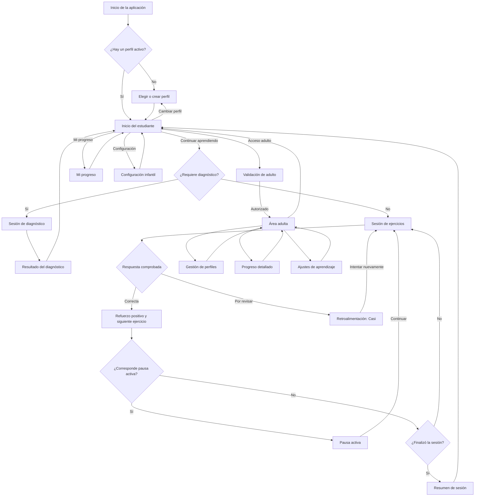

# Navegación de K-Mat IA

Este mapa usa las vistas descritas en `Mockups/descripcion_vistas.txt` y los
mockups 1 a 7. La experiencia principal es para estudiantes de educación
parvularia: una acción relevante por pantalla, botones grandes y sin una barra
de secciones durante una actividad.

## Mapa de pantallas



## Pantallas y destinos

| Destino | Propósito | Entrada | Salida |
|---|---|---|---|
| Elegir o crear perfil | Elegir al estudiante que utilizará la aplicación. | Primer uso o **Cambiar perfil**. | Inicio del estudiante. |
| Inicio del estudiante | Vista del mockup 1. Saludo, acceso a continuar, progreso, perfil, configuración y acceso adulto. | Perfil activo, resumen o progreso. | Diagnóstico o práctica, progreso, perfil, configuración o acceso adulto. |
| Sesión de diagnóstico | Obtiene el nivel inicial antes de recomendar actividades. | Inicio, si el perfil aún no tiene nivel. | Resultado del diagnóstico. |
| Sesión de ejercicios | Vistas de los mockups 2 a 5. Presenta un ejercicio a la vez. | Inicio, diagnóstico, pausa o reintento. | Retroalimentación, pausa, siguiente ejercicio, resumen o confirmar salida. |
| Retroalimentación | Vista del mockup 6. Muestra un intento que puede corregirse y permite reintentar. | Respuesta que necesita revisión. | Sesión de ejercicios o confirmar salida. |
| Pausa activa | Vista del mockup 7. Interrumpe de forma breve y conserva el punto de la sesión. | Regla de pausa de la sesión. | Mismo ejercicio o siguiente ejercicio pendiente. |
| Resumen de sesión | Resume ejercicios, intentos y avance al terminar. | Fin de la sesión o salida confirmada. | Inicio del estudiante. |
| Mi progreso | Muestra avances simples y contenidos por practicar. | Inicio. | Inicio. |
| Configuración infantil | Controla solo preferencias seguras para el estudiante, como sonido o tamaño de apoyo visual. | Ícono de engranaje del inicio. | Inicio. |
| Validación de adulto | Pide PIN, biometría o sesión del adulto. | **Acceso adulto**. | Área adulta o inicio. |
| Área adulta | Ofrece gestión de perfiles, progreso detallado y ajustes pedagógicos. | Validación correcta. | Inicio del estudiante. |

## Reglas de navegación

1. **La sesión conserva su estado.** Al abrir una pausa activa, ver un aviso o
   bloquear la pantalla, se guarda el ejercicio, el trazo y el intento en curso.
   Al volver, el estudiante continúa en el mismo punto.
2. **Salir no descarta por accidente.** El botón **Salir** de la sesión abre
   una confirmación. Si se confirma, se registra el intento y se navega al
   resumen; si se cancela, se mantiene la actividad.
3. **El resultado no es una pantalla de navegación general.** Una respuesta
   correcta avanza dentro de la sesión; una respuesta por revisar abre la vista
   de retroalimentación y conserva el trabajo para corregirlo.
4. **La pausa activa se reanuda.** El botón **Continuar** vuelve al ejercicio
   pendiente, sin reiniciar la sesión ni alterar su avance.
5. **El área adulta requiere validación en cada acceso sensible.** No se debe
   exponer el progreso detallado, la gestión de perfiles ni ajustes pedagógicos
   desde el modo infantil sin esa validación.
6. **El botón Atrás vuelve al contexto anterior.** Desde progreso,
   configuración y perfil vuelve al inicio. En diagnóstico o práctica solicita
   confirmar salida. Desde el inicio deja que Android cierre o ponga la app en
   segundo plano.

## Adaptación por dispositivo

- **Tableta en horizontal:** las sesiones siguen la composición de los
  mockups: encabezado arriba, consigna al centro y acciones grandes abajo.
- **Teléfono en vertical:** se conserva el mismo orden: encabezado, progreso,
  consigna, respuesta y acciones. El contenido puede desplazarse si la altura
  es insuficiente; los controles de comprobación permanecen accesibles.
- **Modo estudiante:** no muestra `NavigationRail` ni barra inferior. El inicio
  concentra los accesos y la sesión elimina distracciones.

## Rutas que implementará la aplicación

```text
profile-selection
home
diagnostic
practice/{sessionId}
practice-feedback/{sessionId}
active-break/{sessionId}
session-summary/{sessionId}
progress
child-settings
adult-auth
adult-home
adult-profiles
adult-progress
adult-learning-settings
```

Los identificadores de sesión se usarán para recuperar ejercicios, respuestas e
intentos guardados localmente y sincronizarlos posteriormente con Supabase.
